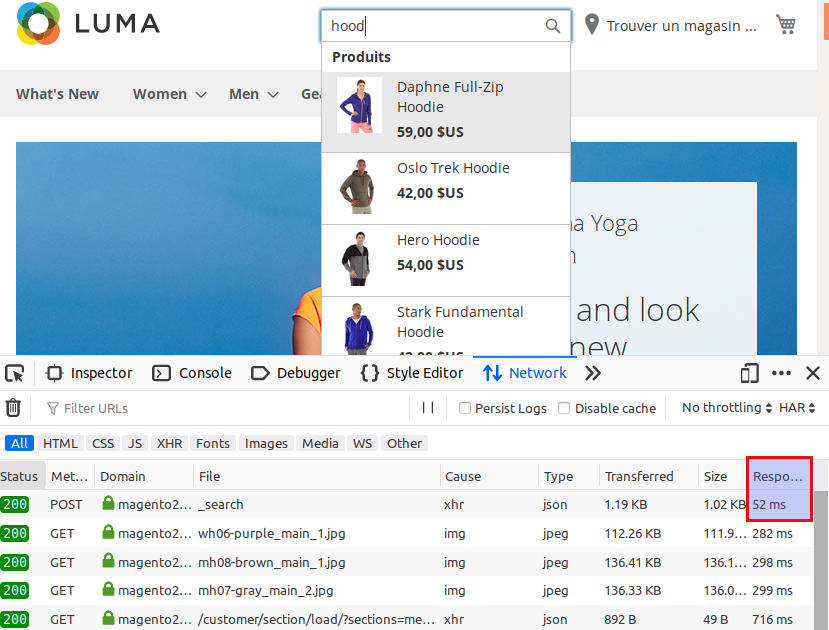

# Fast autocomplete magento 2


## Status

Proof of concept

There is a lot of TODO in the javascript code to match code standards

## Purpose

The purpose of this module is to improve performance of suggest queries.

As we can see in smile/module-elasticsuite-core, one search/suggest/ajax query will request internaly several time mysql and elasticsearch to retrieve terms, product and categories.


Given all of this data is already in the elasticsearch indices, we could actually bypass the whole magento stack.

## Results

Here is a run of the optimisation.

  * First of all, the query is 20X faster and below 100ms.

  * Beside, product and category are comming in two paralel ajax requests.




## Requirement

This module require smile/module-elasticsuite-core at version 2.8 and a frontal access to the elasticsearch engine.

This require a proper security setup to enable only suggest request in readonly mode on the right index of the engine.

You will also need CORS or using the same reverse proxy as magento.

For example, with a nginx location :
```
    location /elastic/ {
        limit_except GET {
            deny  all;
        }
        proxy_pass "http://elasticsearch:9200/";
    }
```